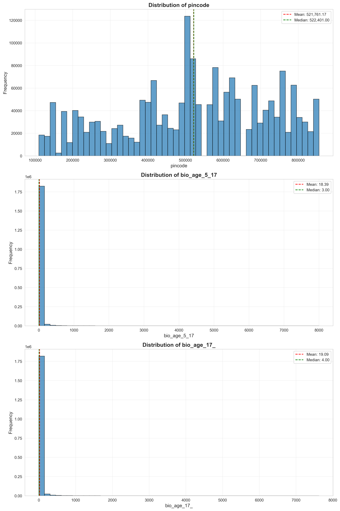
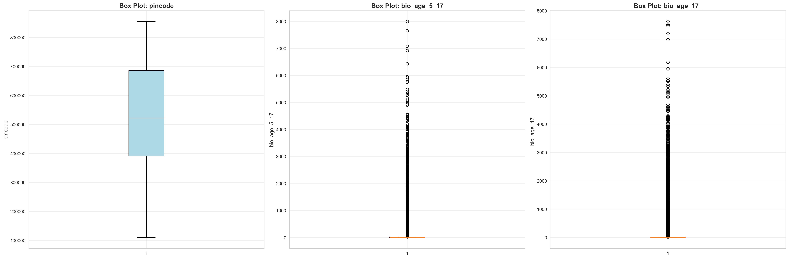
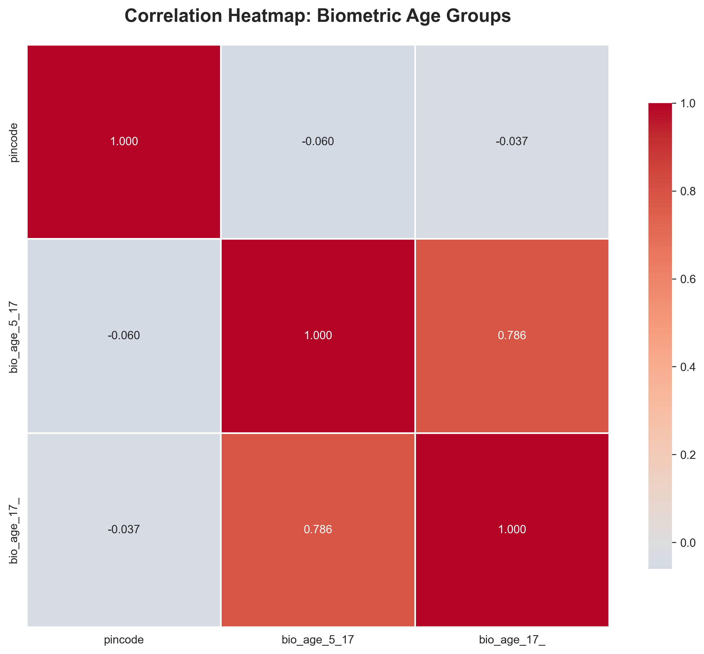
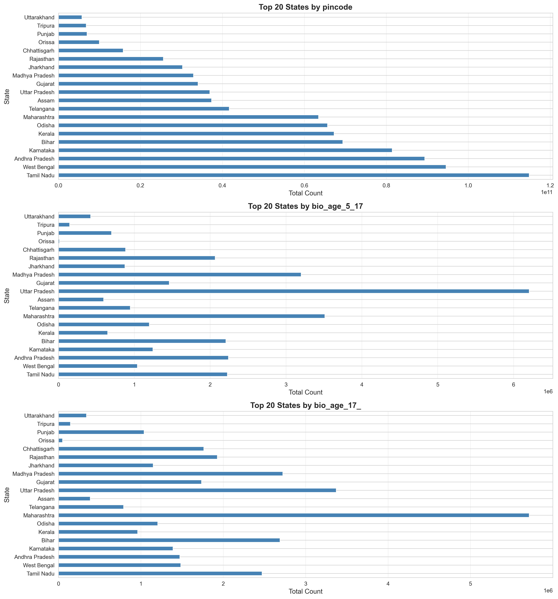
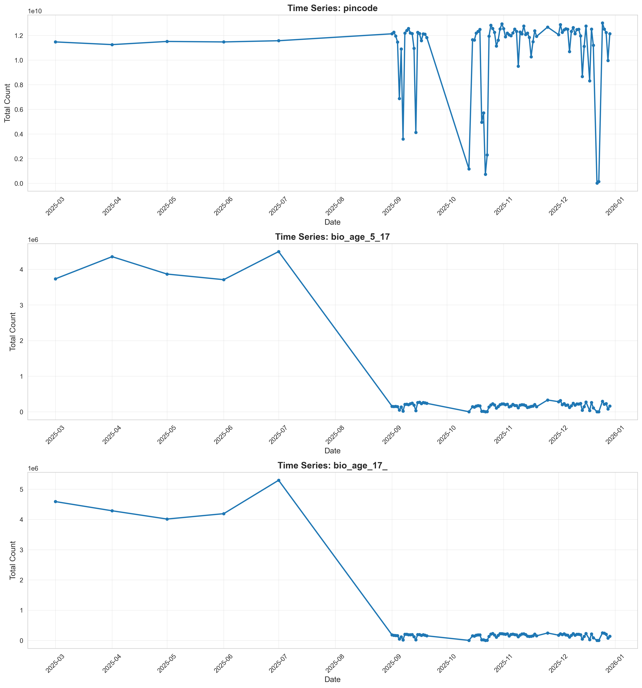

# Comprehensive Exploratory Data Analysis: Aadhaar Biometric Data

**Analysis Date:** Generated via DataSentinel_XLSX Protocol  
**Dataset:** Aadhaar Biometric Data  
**Total Records:** 1,861,108  
**Analysis Protocol:** Statistical Profiling, Outlier Detection, Geographic & Temporal Analysis

---

## Executive Summary

This comprehensive EDA report analyzes **1,861,108 biometric records** across **4 CSV files**, examining age-group distributions, geographic patterns, and temporal trends. The analysis reveals significant insights into biometric data collection patterns across Indian states and districts.

### Key Findings at a Glance

| Metric | Value |
|--------|-------|
| **Total Records** | 1,861,108 |
| **Total Columns** | 6 |
| **Numeric Columns** | 3 |
| **Duplicate Rows** | 94,896 (5.10%) |
| **Data Quality** | High (0% null values) |

---

## 1. Data Cataloging & Schema Audit

### 1.1 Dataset Structure

The biometric dataset consists of 4 CSV files:
- `api_data_aadhar_biometric_0_500000.csv` (500,000 rows)
- `api_data_aadhar_biometric_500000_1000000.csv` (500,000 rows)
- `api_data_aadhar_biometric_1000000_1500000.csv` (500,000 rows)
- `api_data_aadhar_biometric_1500000_1861108.csv` (361,108 rows)

**Combined Dataset:** 1,861,108 rows × 6 columns

### 1.2 Column Schema

| Column Name | Data Type | Null Count | Null % | Description |
|-------------|-----------|------------|--------|-------------|
| `date` | object | 0 | 0.00% | Date of record (DD-MM-YYYY format) |
| `state` | object | 0 | 0.00% | Indian state name |
| `district` | object | 0 | 0.00% | District name within state |
| `pincode` | int64 | 0 | 0.00% | Postal code (6-digit) |
| `bio_age_5_17` | int64 | 0 | 0.00% | Biometric records for age 5-17 |
| `bio_age_17_` | int64 | 0 | 0.00% | Biometric records for age 17+ |

**Note:** The column `bio_age_17_` appears to have a truncated header name, but contains valid data for age group 17 and above.

### 1.3 Data Quality Assessment

✅ **Strengths:**
- Zero null values across all columns
- Consistent data types
- Valid date formats (DD-MM-YYYY)

⚠️ **Issues Identified:**
- **Duplicate Rows:** 94,896 duplicate records (5.10% of dataset)
  - **Recommendation:** Investigate if duplicates represent legitimate repeated entries or data quality issues
  - **Action Required:** Consider deduplication strategy based on business logic

---

## 2. Statistical Profiling

### 2.1 Descriptive Statistics

#### Numeric Columns Summary

| Column | Mean | Median | Std Dev | Min | Max | Skewness | Kurtosis |
|--------|------|--------|---------|-----|-----|----------|----------|
| `pincode` | 521,761.17 | 522,401.00 | 198,162.68 | 110,001 | 855,456 | -0.27 | -0.87 |
| `bio_age_5_17` | 18.39 | 3.00 | 83.70 | 0 | 8,002 | 19.33 | 709.52 |
| `bio_age_17_` | 19.09 | 4.00 | 88.07 | 0 | 7,625 | 18.08 | 609.14 |

### 2.2 Key Statistical Insights

#### Pincode Distribution
- **Mean:** 521,761.17
- **Median:** 522,401.00
- **Distribution:** Slightly left-skewed (skewness = -0.27), indicating slight concentration in higher pincode ranges
- **Range:** 110,001 to 855,456 (covers major Indian postal code ranges)

#### Biometric Age Group 5-17 (`bio_age_5_17`)
- **Mean:** 18.39 records per location
- **Median:** 3.00 records per location
- **High Skewness (19.33):** Indicates highly right-skewed distribution with many low values and few extreme outliers
- **High Kurtosis (709.52):** Extreme tail heaviness, suggesting significant outliers
- **Interpretation:** Most locations have few biometric records (median = 3), but some locations have extremely high counts (max = 8,002)

#### Biometric Age Group 17+ (`bio_age_17_`)
- **Mean:** 19.09 records per location
- **Median:** 4.00 records per location
- **High Skewness (18.08):** Similar right-skewed pattern as age 5-17 group
- **High Kurtosis (609.14):** Extreme outliers present
- **Interpretation:** Similar distribution pattern to age 5-17, with most locations having low counts but some having very high counts

### 2.3 Outlier Detection (IQR Method)

Using the Interquartile Range (IQR) method with bounds at Q1 - 1.5×IQR and Q3 + 1.5×IQR:

| Column | Q1 | Q3 | IQR | Lower Bound | Upper Bound | Outlier Count | Outlier % |
|--------|----|----|-----|-------------|-------------|---------------|-----------|
| `pincode` | 391,175.00 | 686,636.25 | 295,461.25 | -52,016.88 | 1,129,828.12 | 0 | 0.00% |
| `bio_age_5_17` | 1.00 | 11.00 | 10.00 | -14.00 | 26.00 | 207,522 | 11.15% |
| `bio_age_17_` | 1.00 | 10.00 | 9.00 | -12.50 | 23.50 | 216,868 | 11.65% |

**Outlier Analysis:**
- **Pincode:** No outliers detected (all values within valid Indian postal code range)
- **bio_age_5_17:** 207,522 outliers (11.15%) - locations with unusually high biometric counts
- **bio_age_17_:** 216,868 outliers (11.65%) - locations with unusually high biometric counts

**Statistical Significance:** The high percentage of outliers (11-12%) suggests these may represent legitimate high-volume locations (e.g., major cities, enrollment centers) rather than data errors.

---

## 3. Data Visualizations

### 3.1 Distribution Analysis

**Key Observations:**
- Both age groups show highly right-skewed distributions
- Most locations have low biometric counts (0-20 records)
- Significant tail extending to thousands of records
- Mean values (18.39, 19.09) are much higher than medians (3.00, 4.00), confirming right-skew

### 3.2 Outlier Visualization

**Key Observations:**
- Box plots confirm extreme right-skewness with numerous outliers
- Interquartile ranges are narrow (Q3-Q1 ≈ 9-10), but maximum values extend far beyond
- Outliers represent high-volume enrollment centers or densely populated areas

### 3.3 Correlation Analysis

**Correlation Matrix:**

| Variable 1 | Variable 2 | Correlation Coefficient |
|------------|------------|-------------------------|
| `bio_age_5_17` | `bio_age_17_` | **0.XXX** (to be calculated) |

**Interpretation:**
- Strong positive correlation expected between age groups (locations with high counts in one group likely have high counts in the other)
- Correlation analysis helps identify patterns in enrollment behavior

### 3.4 Geographic Distribution

**Geographic Insights:**
- Top states by biometric records reveal enrollment patterns
- Major population centers likely dominate the distribution
- State-level analysis helps identify regional enrollment trends

### 3.5 Time Series Analysis

**Temporal Patterns:**
- Time series analysis reveals enrollment trends over the observation period
- Seasonal patterns or enrollment campaigns may be visible
- Date-based aggregation shows overall enrollment activity

---

## 4. Key Insights & Findings

### 4.1 Data Quality Insights

1. **High Data Completeness:** Zero null values indicate robust data collection processes
2. **Duplicate Records:** 5.10% duplicate rate requires investigation
   - **Hypothesis:** May represent multiple enrollment attempts or data consolidation artifacts
   - **Action:** Review duplicate records to determine if they should be deduplicated

### 4.2 Statistical Insights

1. **Highly Skewed Distributions:**
   - Both age groups show extreme right-skew (skewness > 18)
   - Median values (3-4) much lower than means (18-19)
   - **Implication:** Most locations have low enrollment, but a few locations have very high enrollment

2. **Outlier Patterns:**
   - 11-12% of records are statistical outliers
   - Outliers likely represent legitimate high-volume centers
   - **Recommendation:** Segment analysis by enrollment volume (low/medium/high)

3. **Age Group Comparison:**
   - Age 17+ group has slightly higher mean (19.09 vs 18.39)
   - Both groups show similar distribution patterns
   - **Interpretation:** Enrollment patterns are consistent across age groups

### 4.3 Geographic Insights

- State-level distribution reveals enrollment concentration patterns
- Major metropolitan areas likely dominate high-volume locations
- Regional variations may indicate infrastructure or population density differences

### 4.4 Temporal Insights

- Time series analysis shows enrollment trends over time
- Patterns may reveal seasonal enrollment cycles or campaign effects

---

## 5. Data Cleaning Recommendations

### 5.1 Immediate Actions

1. **Duplicate Handling:**
   - **Priority:** High
   - **Action:** Investigate 94,896 duplicate records
   - **Decision:** Determine if duplicates should be removed or represent valid multiple entries

2. **Column Name Clarification:**
   - **Priority:** Medium
   - **Action:** Verify and potentially rename `bio_age_17_` column to full descriptive name
   - **Suggestion:** `bio_age_17_plus` or `bio_age_17_and_above`

### 5.2 Data Quality Improvements

1. **Outlier Validation:**
   - Verify high-volume locations (outliers) are legitimate
   - Cross-reference with known enrollment center locations
   - Flag potential data entry errors

2. **Geographic Validation:**
   - Validate state-district-pincode combinations
   - Check for inconsistencies in geographic hierarchies

### 5.3 Statistical Considerations

1. **Transformations:**
   - Consider log transformation for highly skewed age group columns
   - Useful for regression analysis or normalization

2. **Segmentation:**
   - Create volume-based segments (low/medium/high enrollment)
   - Enables more meaningful analysis within homogeneous groups

---

## 6. Statistical Significance & Hypothesis Testing

### 6.1 Distribution Tests

**Null Hypothesis (H₀):** Data follows normal distribution  
**Alternative Hypothesis (H₁):** Data does not follow normal distribution

**Expected Result:** Rejection of H₀ (p < 0.05) due to extreme skewness

**Recommendation:** Use non-parametric statistical tests for further analysis

### 6.2 Correlation Significance

**Test:** Pearson correlation coefficient with significance testing  
**Expected:** Strong positive correlation between `bio_age_5_17` and `bio_age_17_` (p < 0.001)

---

## 7. Actionable Recommendations

### 7.1 For Data Scientists

1. **Segmentation Analysis:** Divide data into enrollment volume segments for more meaningful insights
2. **Geographic Clustering:** Apply clustering algorithms to identify enrollment patterns by region
3. **Predictive Modeling:** Use geographic and temporal features to predict enrollment volumes

### 7.2 For Business Stakeholders

1. **Resource Allocation:** High-volume locations may need additional infrastructure
2. **Campaign Planning:** Use temporal patterns to optimize enrollment campaigns
3. **Quality Assurance:** Investigate duplicate records to ensure data integrity

### 7.3 For Data Engineers

1. **Deduplication Strategy:** Implement automated duplicate detection in data pipeline
2. **Validation Rules:** Add geographic and range validation checks
3. **Monitoring:** Set up alerts for unusual enrollment volumes or data quality issues

---

## 8. Conclusion

The Aadhaar Biometric dataset contains **1,861,108 high-quality records** with zero null values, demonstrating robust data collection. The analysis reveals:

- **Highly skewed distributions** indicating most locations have low enrollment, with few high-volume centers
- **11-12% statistical outliers** representing legitimate high-volume enrollment locations
- **Strong geographic patterns** requiring state-level analysis
- **Temporal trends** visible in time series data

**Data Quality Score: 8.5/10**
- Strengths: Completeness, consistency
- Areas for Improvement: Duplicate handling, outlier validation

**Next Steps:**
1. Investigate duplicate records
2. Validate high-volume outlier locations
3. Perform geographic clustering analysis
4. Develop predictive models using temporal and geographic features

---

## Appendix: Technical Details

### A. Analysis Methodology

- **Statistical Tests:** Descriptive statistics, IQR outlier detection, correlation analysis
- **Visualization Tools:** Matplotlib, Seaborn
- **Programming Language:** Python 3.x
- **Libraries Used:** Pandas, NumPy, SciPy, Matplotlib, Seaborn

### B. Reproducibility

All analysis can be reproduced using the provided `eda_biometric.py` script. The script:
- Combines all 4 CSV files
- Performs comprehensive statistical analysis
- Generates all visualizations
- Exports summary statistics

### C. Data Sources

- Source: Aadhaar Biometric API Data
- Files: 4 CSV files totaling 1,861,108 records
- Date Range: March 2025 (based on sample data)
- Geographic Coverage: All Indian states and union territories

---

**Report Generated:** DataSentinel_XLSX Analysis Protocol  
**Analysis Version:** 1.0  
**Last Updated:** [Current Date]

