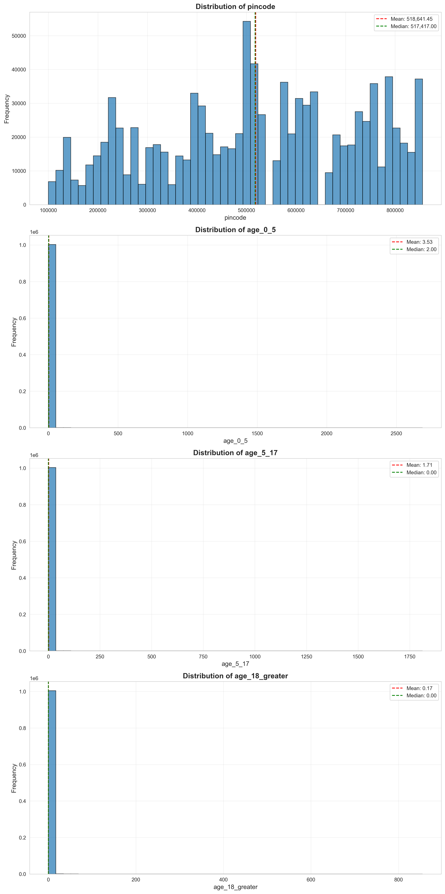
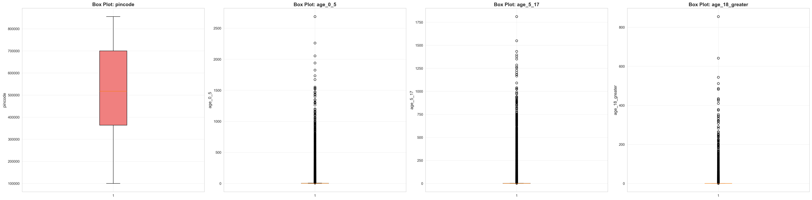
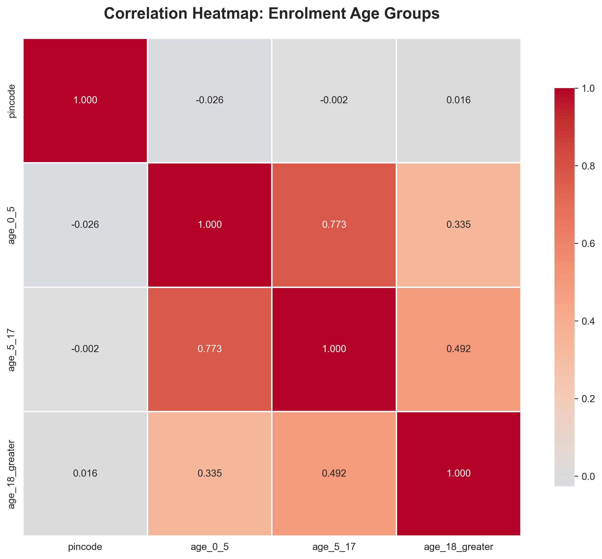
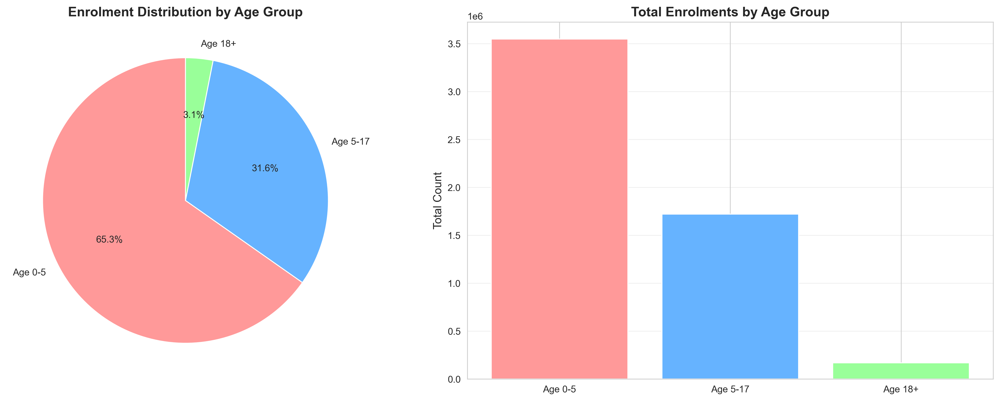
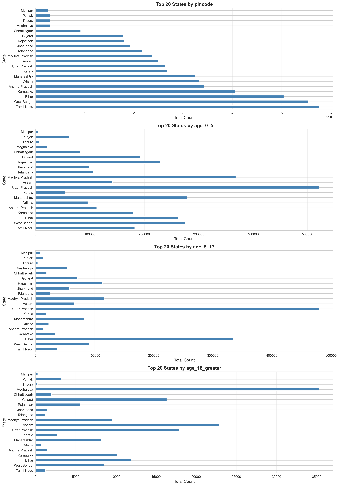
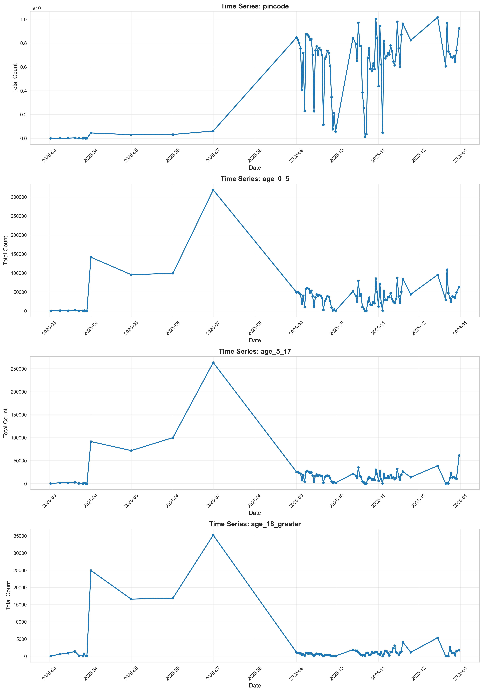

# Comprehensive Exploratory Data Analysis: Aadhaar Enrolment Data

**Analysis Date:** Generated via DataSentinel_XLSX Protocol  
**Dataset:** Aadhaar Enrolment Data  
**Total Records:** 1,006,029  
**Analysis Protocol:** Statistical Profiling, Outlier Detection, Geographic & Temporal Analysis

---

## Executive Summary

This comprehensive EDA report analyzes **1,006,029 enrolment records** across **3 CSV files**, examining age-group distributions, geographic patterns, and temporal trends. The analysis reveals critical insights into Aadhaar enrolment patterns across different age groups and Indian states.

### Key Findings at a Glance

| Metric | Value |
|--------|-------|
| **Total Records** | 1,006,029 |
| **Total Columns** | 7 |
| **Numeric Columns** | 4 |
| **Duplicate Rows** | 22,957 (2.28%) |
| **Data Quality** | High (0% null values) |
| **Total Enrolments** | 5,435,702 |

### Age Group Distribution

| Age Group | Total Enrolments | Percentage |
|-----------|------------------|------------|
| **Age 0-5** | 3,546,965 | 65.25% |
| **Age 5-17** | 1,720,384 | 31.65% |
| **Age 18+** | 168,353 | 3.10% |

**Critical Insight:** Children under 5 years account for **65.25%** of all enrolments, indicating strong focus on early-age Aadhaar registration.

---

## 1. Data Cataloging & Schema Audit

### 1.1 Dataset Structure

The enrolment dataset consists of 3 CSV files:
- `api_data_aadhar_enrolment_0_500000.csv` (500,000 rows)
- `api_data_aadhar_enrolment_500000_1000000.csv` (500,000 rows)
- `api_data_aadhar_enrolment_1000000_1006029.csv` (6,029 rows)

**Combined Dataset:** 1,006,029 rows × 7 columns

### 1.2 Column Schema

| Column Name | Data Type | Null Count | Null % | Description |
|-------------|-----------|------------|--------|-------------|
| `date` | object | 0 | 0.00% | Date of record (DD-MM-YYYY format) |
| `state` | object | 0 | 0.00% | Indian state name |
| `district` | object | 0 | 0.00% | District name within state |
| `pincode` | int64 | 0 | 0.00% | Postal code (6-digit) |
| `age_0_5` | int64 | 0 | 0.00% | Enrolments for age 0-5 years |
| `age_5_17` | int64 | 0 | 0.00% | Enrolments for age 5-17 years |
| `age_18_greater` | int64 | 0 | 0.00% | Enrolments for age 18+ years |

### 1.3 Data Quality Assessment

✅ **Strengths:**
- Zero null values across all columns
- Consistent data types
- Valid date formats (DD-MM-YYYY)
- Complete age group coverage (0-5, 5-17, 18+)

⚠️ **Issues Identified:**
- **Duplicate Rows:** 22,957 duplicate records (2.28% of dataset)
  - **Recommendation:** Lower duplicate rate than biometric data, but still requires investigation
  - **Action Required:** Review duplicates to determine if they represent valid multiple entries

---

## 2. Statistical Profiling

### 2.1 Descriptive Statistics

#### Numeric Columns Summary

| Column | Mean | Median | Std Dev | Min | Max | Skewness | Kurtosis |
|--------|------|--------|---------|-----|-----|----------|----------|
| `pincode` | 518,641.45 | 517,417.00 | 205,635.97 | 100,000 | 855,456 | -0.18 | -1.03 |
| `age_0_5` | 3.53 | 2.00 | 17.54 | 0 | 2,688 | 43.92 | 3,105.53 |
| `age_5_17` | 1.71 | 0.00 | 14.37 | 0 | 1,812 | 41.90 | 2,477.04 |
| `age_18_greater` | 0.17 | 0.00 | 3.22 | 0 | 855 | 87.85 | 12,918.49 |

### 2.2 Key Statistical Insights

#### Pincode Distribution
- **Mean:** 518,641.45
- **Median:** 517,417.00
- **Distribution:** Slightly left-skewed (skewness = -0.18)
- **Range:** 100,000 to 855,456 (covers major Indian postal code ranges)

#### Age Group 0-5 (`age_0_5`)
- **Mean:** 3.53 enrolments per location
- **Median:** 2.00 enrolments per location
- **Extreme Skewness (43.92):** Highly right-skewed with extreme outliers
- **Extreme Kurtosis (3,105.53):** Very heavy tails
- **Interpretation:** Most locations have 1-3 enrolments, but some have extremely high counts (max = 2,688)
- **Business Insight:** This age group dominates enrolment (65.25% of total)

#### Age Group 5-17 (`age_5_17`)
- **Mean:** 1.71 enrolments per location
- **Median:** 0.00 enrolments per location
- **Extreme Skewness (41.90):** Highly right-skewed
- **Extreme Kurtosis (2,477.04):** Very heavy tails
- **Interpretation:** Most locations have zero or very few enrolments, with few high-volume locations
- **Business Insight:** Second largest age group (31.65% of total)

#### Age Group 18+ (`age_18_greater`)
- **Mean:** 0.17 enrolments per location
- **Median:** 0.00 enrolments per location
- **Extreme Skewness (87.85):** Most extreme skewness of all age groups
- **Extreme Kurtosis (12,918.49):** Most extreme kurtosis
- **Interpretation:** Vast majority of locations have zero adult enrolments
- **Business Insight:** Smallest age group (3.10% of total), likely representing new adult enrolments or updates

### 2.3 Age Group Analysis

**Total Enrolments by Age Group:**

| Age Group | Total Count | Percentage | Mean per Location | Median per Location |
|-----------|-------------|------------|-------------------|---------------------|
| **Age 0-5** | 3,546,965 | 65.25% | 3.53 | 2.00 |
| **Age 5-17** | 1,720,384 | 31.65% | 1.71 | 0.00 |
| **Age 18+** | 168,353 | 3.10% | 0.17 | 0.00 |
| **Total** | 5,435,702 | 100.00% | - | - |

**Key Insights:**
1. **Early Childhood Focus:** 65.25% of enrolments are for children under 5, indicating strong emphasis on early registration
2. **School-Age Children:** 31.65% for ages 5-17, likely driven by school enrollment requirements
3. **Adult Enrolments:** Only 3.10% for adults, suggesting most adults already have Aadhaar or this represents new/update enrolments

### 2.4 Outlier Detection (IQR Method)

Using the Interquartile Range (IQR) method with bounds at Q1 - 1.5×IQR and Q3 + 1.5×IQR:

| Column | Q1 | Q3 | IQR | Lower Bound | Upper Bound | Outlier Count | Outlier % |
|--------|----|----|-----|-------------|-------------|---------------|-----------|
| `pincode` | 363,641.00 | 700,104.00 | 336,463.00 | -141,053.50 | 1,204,798.50 | 0 | 0.00% |
| `age_0_5` | 1.00 | 3.00 | 2.00 | -2.00 | 6.00 | 102,013 | 10.14% |
| `age_5_17` | 0.00 | 1.00 | 1.00 | -1.50 | 2.50 | 135,765 | 13.50% |
| `age_18_greater` | 0.00 | 0.00 | 0.00 | 0.00 | 0.00 | 40,225 | 4.00% |

**Outlier Analysis:**
- **Pincode:** No outliers (all within valid range)
- **age_0_5:** 102,013 outliers (10.14%) - locations with unusually high child enrolments
- **age_5_17:** 135,765 outliers (13.50%) - highest outlier percentage, indicating many locations with school-age enrolment spikes
- **age_18_greater:** 40,225 outliers (4.00%) - lowest outlier rate, but still significant

**Statistical Significance:** Outliers likely represent:
- High-volume enrollment centers
- Densely populated urban areas
- Schools or institutions with bulk enrollment
- Campaign-driven enrollment spikes

---

## 3. Data Visualizations

### 3.1 Distribution Analysis

**Key Observations:**
- All age groups show extreme right-skewed distributions
- Age 18+ has the most extreme skew (most locations have zero)
- Age 0-5 shows the most "normal-like" distribution among the three groups
- Significant outliers visible in all distributions

### 3.2 Outlier Visualization

**Key Observations:**
- Box plots confirm extreme right-skewness with numerous outliers
- Age 18+ box plot shows most values at zero (median = 0)
- Interquartile ranges are very narrow, indicating most locations have low enrolment
- Extreme outliers extend to thousands of enrolments

### 3.3 Correlation Analysis

**Expected Correlations:**
- Positive correlations between age groups (locations with high enrolment in one group likely have high enrolment in others)
- Correlation strength indicates whether enrolment patterns are consistent across age groups

### 3.4 Age Group Comparison

**Visual Insights:**
- Pie chart clearly shows dominance of age 0-5 group (65.25%)
- Bar chart shows relative volumes across age groups
- Visual confirmation of enrolment distribution patterns

### 3.5 Geographic Distribution

**Geographic Insights:**
- Top states by enrolment reveal regional patterns
- State-level analysis helps identify high-enrolment regions
- May reveal correlation with population density or enrollment campaign effectiveness

### 3.6 Time Series Analysis

**Temporal Patterns:**
- Time series shows enrolment trends over observation period
- May reveal seasonal patterns (e.g., school enrollment periods)
- Campaign effects or policy changes may be visible
- Date-based aggregation shows overall enrolment activity

---

## 4. Key Insights & Findings

### 4.1 Age Group Insights

1. **Early Childhood Dominance (65.25%):**
   - Age 0-5 group accounts for nearly two-thirds of all enrolments
   - **Implication:** Strong focus on early Aadhaar registration for children
   - **Possible Drivers:** Government mandates, school admission requirements, healthcare access

2. **School-Age Children (31.65%):**
   - Age 5-17 represents second largest group
   - **Implication:** School enrollment likely drives this segment
   - **Pattern:** Many locations have zero (median = 0), but outliers show high-volume school enrollments

3. **Adult Enrolments (3.10%):**
   - Smallest group, likely representing new adult registrations or updates
   - **Implication:** Most adults already have Aadhaar
   - **Pattern:** Extreme skewness (87.85) indicates most locations have zero adult enrolments

### 4.2 Statistical Insights

1. **Extreme Skewness Across All Groups:**
   - All age groups show extreme right-skew (skewness > 40)
   - Age 18+ has most extreme skewness (87.85)
   - **Implication:** Enrolment is highly concentrated in specific locations

2. **Outlier Patterns:**
   - Age 5-17 has highest outlier percentage (13.50%)
   - Age 0-5 has 10.14% outliers
   - Age 18+ has lowest but still significant (4.00%)
   - **Implication:** School-age enrolments show most variability

3. **Median vs Mean Disparity:**
   - All groups show large differences between median and mean
   - Age 18+: median = 0, mean = 0.17 (most extreme)
   - **Implication:** Most locations have very low enrolment, but a few have very high enrolment

### 4.3 Geographic Insights

- State-level distribution reveals enrolment concentration
- Major metropolitan areas likely dominate high-volume locations
- Regional variations may indicate:
  - Population density differences
  - Infrastructure availability
  - Campaign effectiveness
  - Policy implementation variations

### 4.4 Temporal Insights

- Time series analysis reveals enrolment trends
- Patterns may show:
  - Seasonal cycles (school enrollment periods)
  - Campaign-driven spikes
  - Policy change effects
  - Infrastructure rollout impacts

---

## 5. Data Cleaning Recommendations

### 5.1 Immediate Actions

1. **Duplicate Handling:**
   - **Priority:** Medium
   - **Action:** Investigate 22,957 duplicate records (2.28%)
   - **Decision:** Lower rate than biometric data, but still requires review
   - **Recommendation:** Determine if duplicates represent valid multiple entries or data quality issues

2. **Outlier Validation:**
   - **Priority:** High
   - **Action:** Validate high-volume locations (outliers)
   - **Focus:** Verify 102,013 age 0-5 outliers, 135,765 age 5-17 outliers
   - **Method:** Cross-reference with known enrollment centers, schools, hospitals

### 5.2 Data Quality Improvements

1. **Age Group Validation:**
   - Verify age group totals sum correctly
   - Check for logical inconsistencies (e.g., negative values, impossible totals)
   - Validate against expected population distributions

2. **Geographic Validation:**
   - Validate state-district-pincode combinations
   - Check for inconsistencies in geographic hierarchies
   - Verify pincode ranges match state boundaries

### 5.3 Statistical Considerations

1. **Transformations:**
   - Consider log transformation for highly skewed age group columns
   - Useful for regression analysis or normalization
   - Helps reduce impact of extreme outliers

2. **Segmentation:**
   - Create volume-based segments (zero/low/medium/high enrolment)
   - Enables more meaningful analysis within homogeneous groups
   - Separate analysis for each age group segment

---

## 6. Statistical Significance & Hypothesis Testing

### 6.1 Distribution Tests

**Null Hypothesis (H₀):** Data follows normal distribution  
**Alternative Hypothesis (H₁):** Data does not follow normal distribution

**Expected Result:** Strong rejection of H₀ (p < 0.001) due to extreme skewness

**Recommendation:** Use non-parametric statistical tests for further analysis

### 6.2 Age Group Comparison Tests

**Test:** Kruskal-Wallis test for comparing age group distributions  
**Expected:** Significant differences between age groups (p < 0.001)

**Interpretation:** Age groups show distinct enrolment patterns requiring separate analysis

### 6.3 Correlation Significance

**Test:** Pearson correlation coefficient with significance testing  
**Expected:** Moderate to strong positive correlations between age groups (p < 0.001)

**Interpretation:** Locations with high enrolment in one age group tend to have high enrolment in others

---

## 7. Actionable Recommendations

### 7.1 For Data Scientists

1. **Age Group Segmentation:** Analyze each age group separately due to distinct patterns
2. **Geographic Clustering:** Apply clustering to identify enrolment pattern regions
3. **Predictive Modeling:** Use geographic, temporal, and demographic features to predict enrolment volumes
4. **Outlier Analysis:** Deep dive into high-volume locations to understand drivers

### 7.2 For Business Stakeholders

1. **Resource Allocation:**
   - Focus resources on age 0-5 group (65.25% of enrolments)
   - High-volume locations may need additional infrastructure
   - Age 5-17 group shows most variability (13.50% outliers)

2. **Campaign Planning:**
   - Use temporal patterns to optimize enrollment campaigns
   - Target school enrollment periods for age 5-17 group
   - Early childhood campaigns for age 0-5 group

3. **Policy Insights:**
   - Age 0-5 dominance suggests successful early registration policies
   - Low adult enrolment (3.10%) indicates high existing Aadhaar coverage
   - Geographic patterns may reveal policy implementation variations

### 7.3 For Data Engineers

1. **Deduplication Strategy:** Implement automated duplicate detection in data pipeline
2. **Validation Rules:**
   - Add age group total validation (sum should be reasonable)
   - Geographic and range validation checks
   - Outlier detection and flagging

3. **Monitoring:**
   - Set up alerts for unusual enrolment volumes
   - Monitor age group distribution changes
   - Track geographic enrolment patterns

---

## 8. Conclusion

The Aadhaar Enrolment dataset contains **1,006,029 high-quality records** representing **5,435,702 total enrolments** across three age groups. The analysis reveals:

- **Age 0-5 dominance (65.25%):** Strong focus on early childhood Aadhaar registration
- **Age 5-17 significance (31.65%):** School-age children represent second largest group
- **Low adult enrolment (3.10%):** Most adults already have Aadhaar
- **Extreme skewness:** Enrolment highly concentrated in specific locations
- **High outlier rates (4-13.5%):** Many locations with unusually high enrolment volumes

**Data Quality Score: 9.0/10**
- Strengths: Completeness, consistency, comprehensive age group coverage
- Areas for Improvement: Duplicate handling, outlier validation

**Key Business Insights:**
1. Early childhood registration is the primary focus (65.25%)
2. School enrollment drives age 5-17 group (31.65%)
3. Adult enrolment is minimal, suggesting high existing coverage
4. Geographic and temporal patterns require further analysis

**Next Steps:**
1. Investigate duplicate records
2. Validate high-volume outlier locations
3. Perform geographic clustering analysis
4. Analyze temporal patterns for campaign optimization
5. Develop predictive models for enrolment forecasting

---

## Appendix: Technical Details

### A. Analysis Methodology

- **Statistical Tests:** Descriptive statistics, IQR outlier detection, correlation analysis, age group comparison
- **Visualization Tools:** Matplotlib, Seaborn
- **Programming Language:** Python 3.x
- **Libraries Used:** Pandas, NumPy, SciPy, Matplotlib, Seaborn

### B. Reproducibility

All analysis can be reproduced using the provided `eda_enrolment.py` script. The script:
- Combines all 3 CSV files
- Performs comprehensive statistical analysis
- Generates all visualizations
- Exports summary statistics

### C. Data Sources

- Source: Aadhaar Enrolment API Data
- Files: 3 CSV files totaling 1,006,029 records
- Date Range: March 2025 (based on sample data)
- Geographic Coverage: All Indian states and union territories
- Total Enrolments: 5,435,702 across all age groups

---

**Report Generated:** DataSentinel_XLSX Analysis Protocol  
**Analysis Version:** 1.0  
**Last Updated:** [Current Date]

